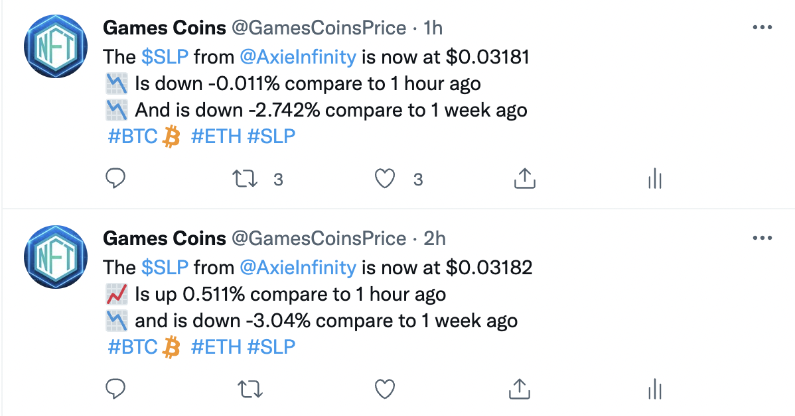
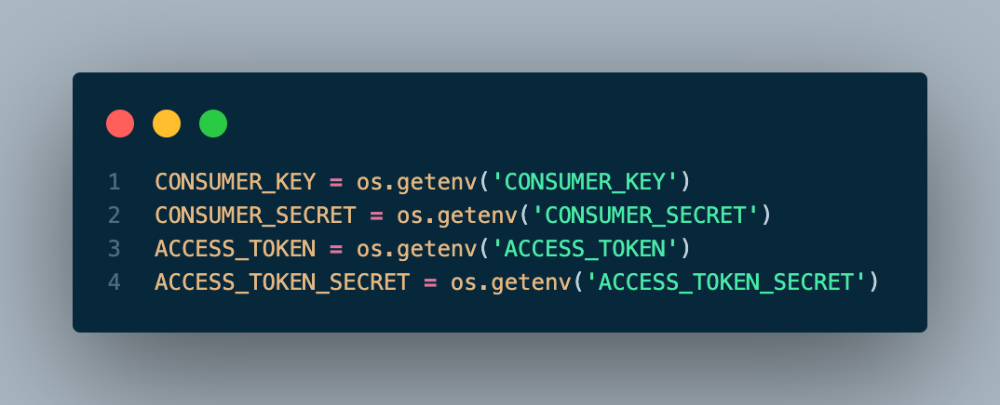
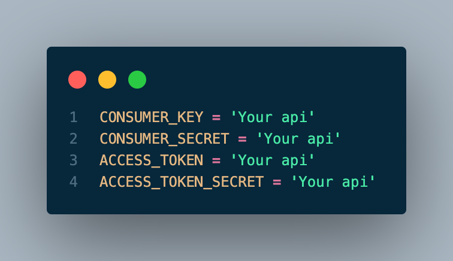
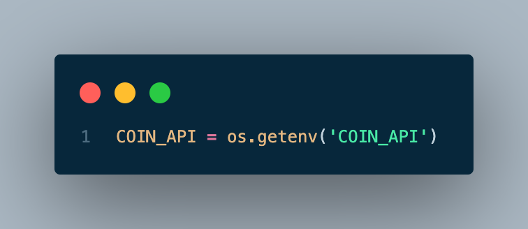
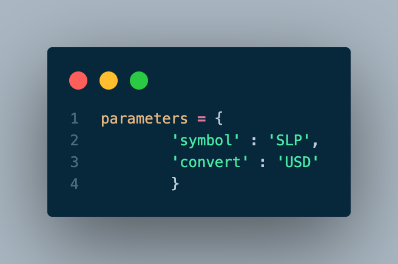
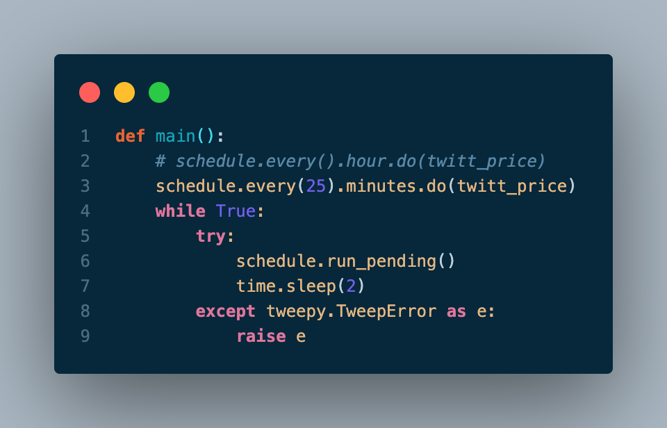
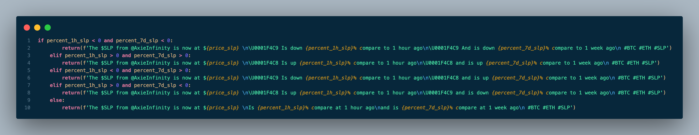

# Coins bot
Currently this bot twitt the next parameters
- The price of the crypto of your choice
- The percentage with respect to 1 hour
- The percentage over 1 week

*Screenshot from my [Twitter](https://twitter.com/GamesCoinsPrice)

## Requerimientos
-  Dev account in [twitter](https://developer.twitter.com/en/portal/dashboard "twitter")
	- CONSUMER_KEY
	- CONSUMER_SECRET
- Account in [Coin market cap pro](https://pro.coinmarketcap.com/account "coinmarketcap") (It's free)
	- ACCESS_TOKEN
	- ACCESS_TOKEN_SECRET

# Let's start

`$ pip install Tweppy`

`$ pip install Schedule`

`$ pip install time`

### Add yours API

## MAIN

You have 2 option, add a .env document or delete all the code that comes after = and add yours API

or

## api_request
And the same in api_request

You have to add your coin api from coin market cap

## Change at your cryto 

In api_request your have to change SLP with the crypto of your choice. For example if you want to twitt Bitcoin use BTC or Ethereum you hava to use ETH, you can read the documentation [here](https://coinmarketcap.com/api/documentation/v1/#operation/getV1CryptocurrencyListingsLatest).

## Every X time twitt my crypto

*Remember install Schedule.*

You can choose between minutes ,hours or days, in this example is between 25 minutes.
if you want to read more information [click here](https://schedule.readthedocs.io/en/stable/)

## Change the twitt

If yoy want to change the twitt is very simple, in api_request you are goin to see this.

I like to twitt diferents emojis if the price is higher or lower, but is not necesary.
You can do it most simple if you want, and only twitt the actual price, let me give you a example:

`return(f'The $SLP from @AxieInfinity is now at ${price_slp}')`.

# Thanks
Thanks for read the documentation, this is my first project and I'm very happy with my code, of course I have a lot to learn, if you have any feedback you can send it to me by mail or twitter

email: gutybv@gmail.com

Twitter: Gutybv